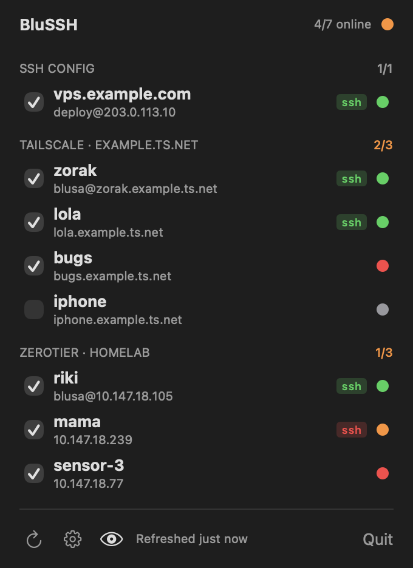
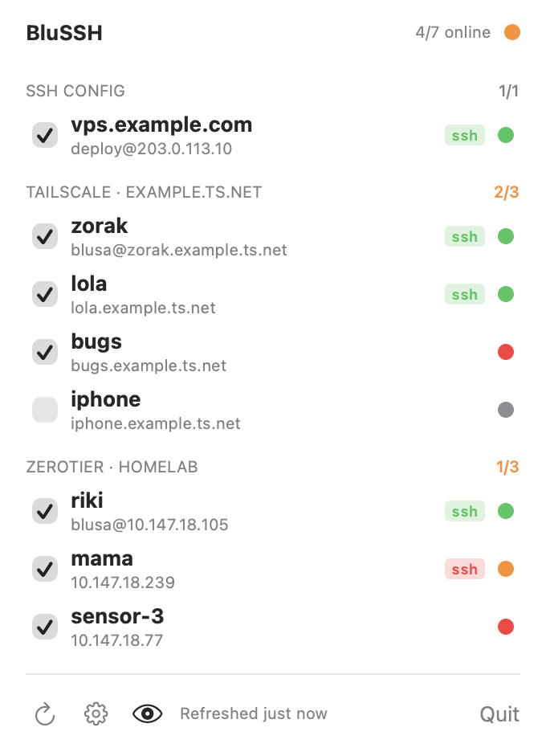
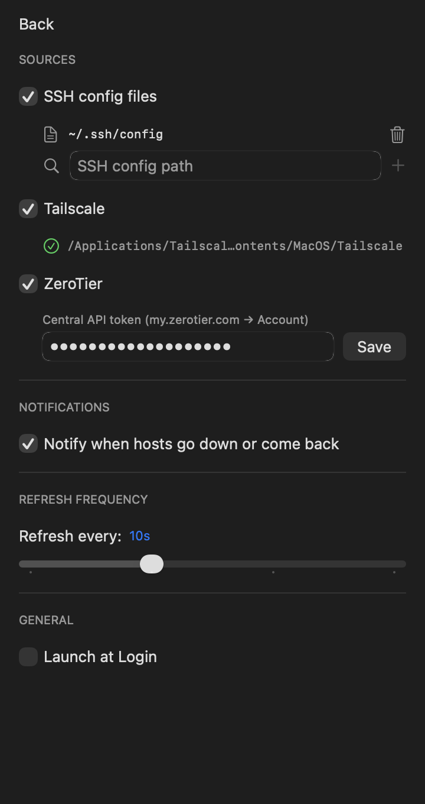

<p align="center">
  
</p>

# blussh

macOS menu bar app that monitors host connectivity. Hosts are discovered
automatically from your **SSH config**, **Tailscale** tailnet, and **ZeroTier**
networks; blussh shows live status and notifies when a host goes down or comes
back up.

| Popover (dark) | Popover (light) | Settings |
|---|---|---|
|  |  |  |

## Features

- **Three host sources**, each toggleable: ssh config files (Stow-friendly
  symlink resolution), `tailscale status --json`, and ZeroTier (local service
  API for joined networks + Central API for member names).
- **Two liveness signals**: what the VPN control plane reports (`netOnline`)
  and a TCP port-22 probe (`sshOnline`) for hosts that run SSH. SSH servers are
  auto-detected with a one-time probe; override per host from the context menu.
- **Cross-source merge**: an ssh-config entry pointing at a VPN host's IP or
  DNS name merges into it, so tap-to-copy yields `ssh user@alias`.
- **Debounced notifications**: a state flip must repeat on 2 consecutive checks
  before notifying — no alerts from a single dropped probe.
- Groups with online counters, per-host enable toggles, hide-disabled switch,
  tap to copy the ssh command, aggregate status dot in the menu bar.

## Install

```bash
brew install blusa/tap/blussh
```

## Release

```bash
scripts/release.sh 1.0.1
```

The script bumps `MARKETING_VERSION` (committing if needed) and pushes the
`v1.0.1` tag. Pushing any `v*` tag triggers the
[Release action](.github/workflows/release.yml), which:

1. builds the app on a macOS runner with hardened runtime and signs it with
   the "Developer ID Application: Pablo Pusiol" certificate (secrets
   `SIGNING_CERT_P12` / `SIGNING_CERT_P12_PASSWORD`; expires 2027-02, renew
   via the developer portal with the CSR in `~/.keys` on Buster),
2. notarizes the zip with `notarytool` (App Store Connect API key secrets
   `ASC_API_KEY_P8` / `ASC_KEY_ID` / `ASC_ISSUER_ID`) and staples the ticket,
3. publishes `blussh-v<version>.zip` as a GitHub release with generated notes,
4. regenerates `Casks/blussh.rb` (template: `scripts/make-cask.sh`) and pushes
   it to [blusa/homebrew-tap](https://github.com/blusa/homebrew-tap).

Cross-repo push uses a write deploy key on the tap, stored as the
`TAP_DEPLOY_KEY` secret in this repo. Watch a run with `gh run watch`.

## Build

```bash
xcodebuild -project blussh.xcodeproj -scheme blussh -configuration Release build
```

Not sandboxed (it execs the tailscale CLI and reads ZeroTier's authtoken).
The ZeroTier Central API token is stored in the Keychain.

## Docs

- [`docs/monitoring-spec.md`](docs/monitoring-spec.md) — platform-agnostic
  functional spec: every external interface (verified JSON shapes), algorithms
  (merge, liveness, debounce), and notes for porting to an Omarchy/Waybar
  taskbar plugin.
- [`docs/superpowers/specs/2026-09-02-vpn-discovery-design.md`](docs/superpowers/specs/2026-09-02-vpn-discovery-design.md)
  — design decisions behind the VPN discovery feature.

The screenshots above are rendered from the real SwiftUI views with demo data
(no personal network info) — see the harness approach in `CLAUDE.md`.
